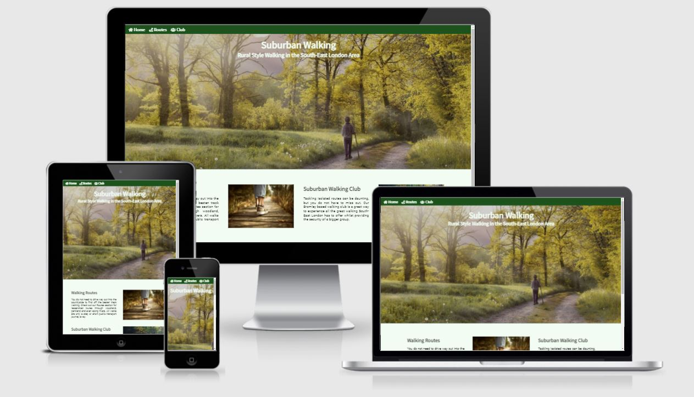
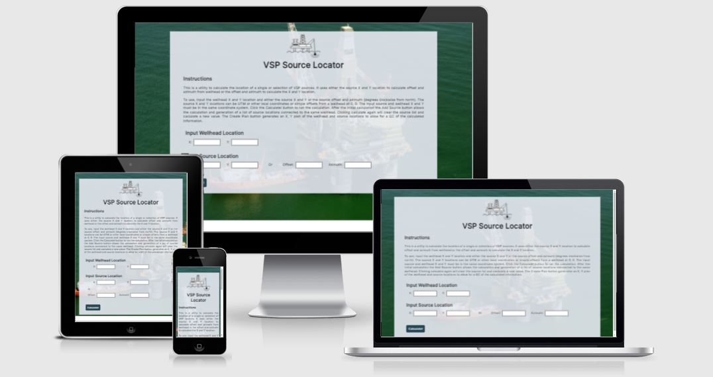
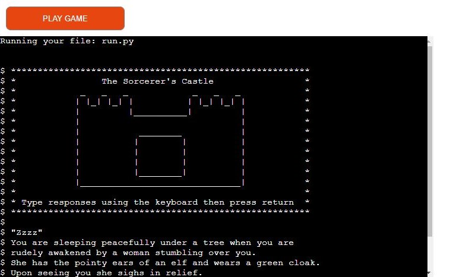
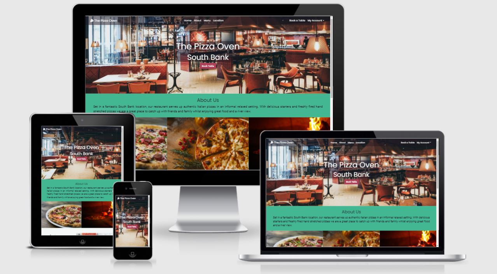
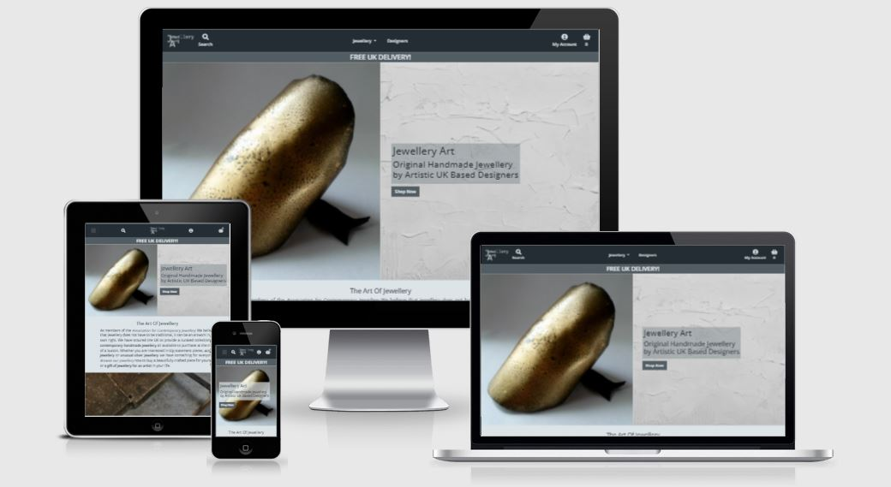

# Hello there I'm Stephanie 👋

Welcome to my profile. I am a Junior Developer from London. I have recently been studying for a Diploma in Full Stack Software Development with the [Code Institute](https://codeinstitute.net/) and have now finished my fifth and final Portfolio Project for the course. I am looking forward to using my new skils and learning many new ones in a Developer role.

## 📬 Contact Me

## 🎓 Code Institute Portfolio Projects

### Project 1 - Suburban Walking

A front end site providing information on walking routes in South East London.

[Repository](https://github.com/Stephanie-Ash/suburban-walking) 
[Live Site](https://stephanie-ash.github.io/suburban-walking/)

### Project 2 - VSP Source Locator

A front end site that calculates the location of a VSP source as either offset and azimuth from the wellhead or X and Y coordinates.

[Repository](https://github.com/Stephanie-Ash/vsp-source-locator) 
[Live Site](https://stephanie-ash.github.io/vsp-source-locator/)

### Project 3 - The Sorcerer's Castle

A text based story game run in the command line.

[Repository](https://github.com/Stephanie-Ash/sorcerers-castle) 
[Live Site](https://sorcerers-castle.onrender.com)

### Project 4 - The Pizza Oven

A full stack site for a pizza restaurant complete with table booking system.

[Repository](https://github.com/Stephanie-Ash/the-pizza-oven) 
[Live Site](https://the-pizza-oven.herokuapp.com/)

### Project 5 - Jewellery Art

A full stack ecommerce site for a Jewellery store.

[Repository](https://github.com/Stephanie-Ash/jewellery-art) 
[Live Site](https://jewellery-art.herokuapp.com/)

## 👊 Hackathon Projects

### The Planeteers

An educational site about recycling complete with recycling game.

[Repository](https://github.com/Stephanie-Ash/the-planeteers) 
[Live Site](https://rvn-r.github.io/the-planeteers/)

### INKLUSION

A virtual tour through the history of LGBTQIA+ art. Won first place in the Code Institute June 2022 Hackathon.

[Repository](https://github.com/Stephanie-Ash/team-6) 
[Live Site](https://alissatroiano.github.io/team-6/)
